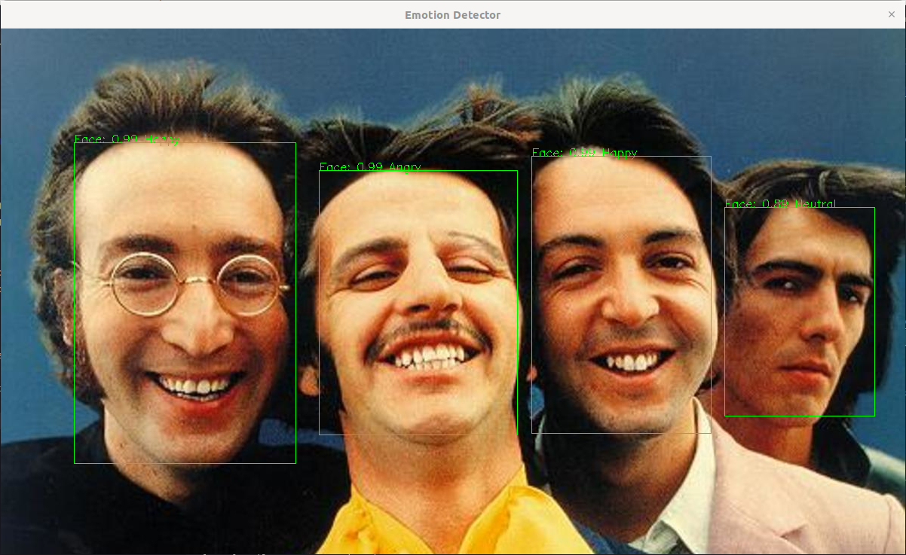

# CPP Emotion Detector

This project aims to use C++ and OpenCV to detect faces and emotions from an image, a sequence of frames, or directly from a webcam using two pre-trained Deep Neural Networks.

This project follows Object Oriented Programming (OOP) and C++ features (e.g. STL, threads, move semantics)

## Dependencies
* cmake >= 3.7
  * All OSes: [click here for installation instructions](https://cmake.org/install/)
* make >= 4.1 (Linux, Mac), 3.81 (Windows)
  * Linux: make is installed by default on most Linux distros
  * Mac: [install Xcode command line tools to get make](https://developer.apple.com/xcode/features/)
  * Windows: [Click here for installation instructions](http://gnuwin32.sourceforge.net/packages/make.htm)
* gcc/g++ >= 5.4
  * Linux: gcc / g++ is installed by default on most Linux distros
  * Mac: same deal as make - [install Xcode command line tools](https://developer.apple.com/xcode/features/)
  * Windows: recommend using [MinGW](http://www.mingw.org/)
* OpenCV >= 4.5.3
  * The OpenCV 4.1 source code can be found [here](https://github.com/opencv/opencv/tree/4.1)

## Requisites

This project uses two [CAFFE](https://caffe.berkeleyvision.org/) pre-trained models for face and emotion detection, and these models should be first downloaded and **MUST** be stored in the src/data/models/ directory.

### Face Detector Model

The face detector model is at the following address:

[res10_300x300_ssd_iter_140000.caffemodel](https://github.com/opencv/opencv_3rdparty/blob/dnn_samples_face_detector_20170830/res10_300x300_ssd_iter_140000.caffemodel)

### Emotion Classification

The emotion classification is at the following address:

[EmotiW_VGG_S.caffemodel](https://drive.google.com/open?id=0BydFau0VP3XSNVYtWnNPMU1TOGM)

The code implemented uses the **VGG_S_rgb/EmotiW_VGG_S.caffemodel**  which is optimized for RGB images.

## Basic Build Instructions

1. Clone this repo.
2. Make a build directory in the top level directory: `mkdir build && cd build`
3. Compile: `cmake .. && make`
4. Run it: `./emotion_detector -i {path_to_image}`.

## Usage

Once built the binary can parse inputs such images, videos or a webcam feed.

### Parameters
  * `-w `  uses the default webcam in the system to detect faces and classify emotions.
    * `./emotion_detector -w`
  * `-v {path_to_video}` will apply the models to a video stream.
    * `./emotion_detector -v ../src/data/videos/beatles2.mp4`
  * `-i {path_to_image}` will apply the models to a static image.
    * `./emotion_detector -i ../src/data/images/beatles.jpg`

After the window is created press any key to quit.

## References

  * https://talhassner.github.io/home/publication/2016_ECCV_1
  * https://talhassner.github.io/home/publication/2015_ICMI
  * https://gist.github.com/GilLevi/54aee1b8b0397721aa4b

_be happy_

